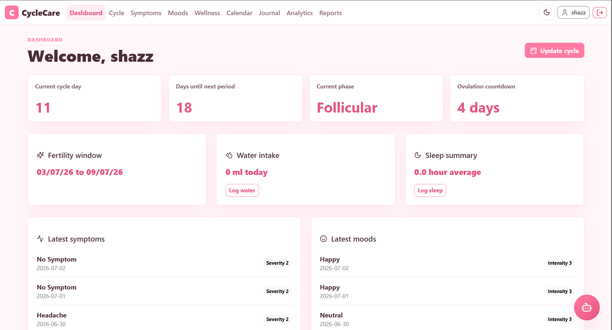
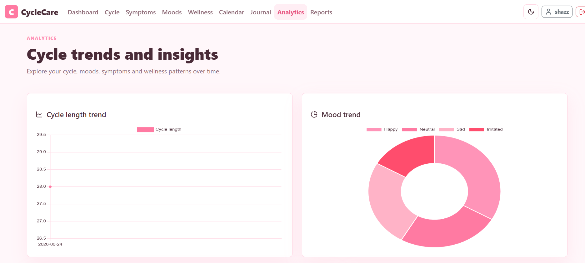
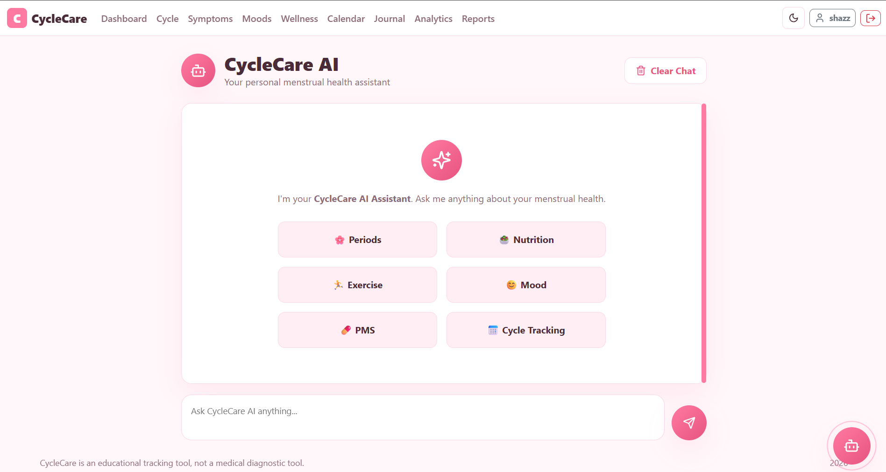
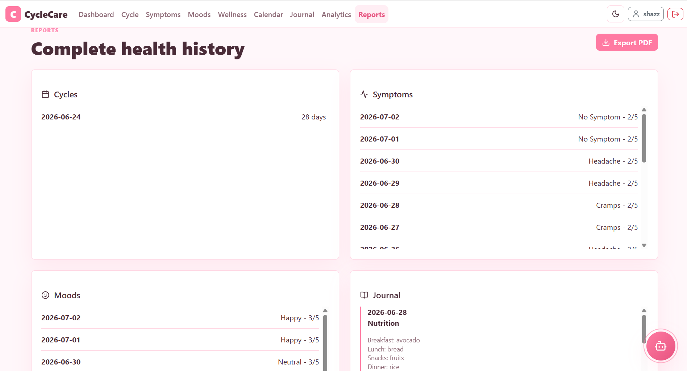

# 🌸 CycleCare – AI-Powered Menstrual Health & Wellness Platform

> A full-stack Spring Boot application for menstrual health tracking, cycle prediction, wellness monitoring, AI-assisted guidance, and health analytics.


---

# 📖 About

CycleCare is a modern **full-stack menstrual health management platform** built using **Java Spring Boot** that enables users to monitor their menstrual cycle, symptoms, moods, nutrition, hydration, sleep, and overall wellness.

The application combines **predictive cycle analytics**, **interactive dashboards**, **AI-powered health guidance**, and **PDF health reports** into a secure, responsive web application.

> **Note:** CycleCare is intended for educational and wellness tracking purposes only. It does **not** provide medical diagnosis.

---

# ✨ Key Highlights

- 🔐 Secure Authentication with Spring Security & BCrypt
- 🌸 Intelligent Menstrual Cycle Prediction
- 🤖 AI Health Assistant powered by Google Gemini
- 📊 Interactive Analytics Dashboard
- 📄 PDF Health Report Generation
- 🍎 Personalized Nutrition Recommendations
- 🏃 Phase-Based Exercise Recommendations
- 📅 Interactive Cycle Calendar
- 🌙 Responsive Light & Dark Mode
- ☁️ Cloud Deployment (Render + Railway)

---

# 🚀 Features

## 🔐 Authentication & Security

- User Registration
- Secure Login
- BCrypt Password Encryption
- Remember-Me Authentication
- Forgot Password
- Reset Password using Secure Token
- Session Management
- Spring Security Authorization

---

## 👤 User Profile

Maintain personalized information including

- Name
- Age
- Height
- Weight
- Activity Level

These values are used for personalized wellness recommendations.

---

## 🌸 Cycle Prediction

Automatically calculates

- Current Cycle Day
- Next Period Date
- Ovulation Date
- Fertility Window
- Menstrual Phase

using historical cycle information.

---

## ❤️ Daily Health Tracking

Track daily wellness data including

- Symptoms
- Mood
- Water Intake
- Sleep
- Nutrition
- Personal Journal

---

## 🥗 Personalized Recommendations

CycleCare provides educational recommendations based on the current menstrual phase including

### Nutrition

- Foods to Prefer
- Foods to Avoid
- Iron-rich Diet
- Hydration Suggestions

### Exercise

- Yoga
- Walking
- Cardio
- Strength Training
- Recovery Activities

---

## 📅 Interactive Calendar

Displays

- Logged Periods
- Predicted Periods
- Ovulation
- Fertility Window
- Symptoms

using an intuitive monthly calendar.

---

## 📊 Analytics Dashboard

Interactive Chart.js visualizations

- Cycle Length Trend
- Mood Trend
- Symptom Frequency
- Cycle Regularity
- Health Insights

---

## 🤖 AI Health Assistant

Integrated with **Google Gemini API** for educational guidance.

Capabilities include

- Menstrual Health Information
- Nutrition Guidance
- Exercise Suggestions
- Lifestyle Tips
- Wellness Questions
- Educational Health Advice

All responses include appropriate safety disclaimers.

---

## 🚨 Health Alerts

Automatically detects possible concerns such as

- Irregular Cycles
- Repeated Severe Symptoms
- Long Cycle Gaps

---

## 📄 PDF Health Reports

Generate downloadable reports containing

- Cycle History
- Symptoms
- Mood Logs
- Sleep Summary
- Hydration Summary
- Nutrition Journal
- Wellness Notes
- Analytics Summary

---

# 🛠 Technology Stack

## Backend

- Java 17
- Spring Boot 3.3.5
- Spring MVC
- Spring Security
- Spring Data JPA
- Hibernate

---

## Frontend

- Thymeleaf
- HTML5
- CSS3
- JavaScript
- Bootstrap 5
- Chart.js

---

## Database

- MySQL

---

## AI Integration

- Google Gemini API

---

## PDF Generation

- OpenPDF

---

## Build Tool

- Maven

---

# 🏗 Architecture

```
                        Browser
                           │
                           ▼
                  Spring MVC Controllers
                           │
        ┌──────────────────┼──────────────────┐
        ▼                  ▼                  ▼
 Cycle Service      Analytics Service    AI Assistant
        │                  │                  │
        │                  │          Google Gemini API
        │                  │
        └──────────────┬───┘
                       ▼
               Spring Data JPA
                       │
                       ▼
                    MySQL
```

---

# 📂 Project Structure

```
CycleCare
│
├── src
│   ├── main
│   │   ├── java/com/cyclecare
│   │   │   ├── config
│   │   │   ├── controller
│   │   │   ├── domain
│   │   │   ├── dto
│   │   │   ├── repository
│   │   │   ├── security
│   │   │   └── service
│   │   │
│   │   └── resources
│   │       ├── static
│   │       │   ├── css
│   │       │   ├── js
│   │       │   └── images
│   │       │
│   │       ├── templates
│   │       │   ├── fragments
│   │       │   └── *.html
│   │       │
│   │       └── application.properties
│   │
│   └── test
│
├── docs
│   ├── API_ENDPOINTS.md
│   ├── ARCHITECTURE.md
│   ├── ER_DIAGRAM.md
│   ├── IMPLEMENTATION_PLAN.md
│   ├── ROADMAP.md
│   └── mysql-schema.sql
│
├── .gitignore
├── docker-compose.yml
├── Dockerfile
├── pom.xml
├── README.md
└── LICENSE (optional)
```


---

# 📚 Documentation

Comprehensive documentation is included in the **docs/** directory.

| Document                       | Description |
|--------------------------------|-------------|
| 📘 docs/ARCHITECTURE.md        | Overall application architecture and module interaction |
| 🗄 docs/ER_DIAGRAM.md          | Database entity relationship diagram |
| 🌐 docs/API_ENDPOINTS.md       | REST API documentation |
| 🛠 docs/IMPLEMENTATION_PLAN.md | Development phases and implementation details |
| 🚀 docs/ROADMAP.md             | Planned future enhancements |
| 🗃 docs/mysql-schema.sql       | Complete MySQL schema |

---

# ⚙ Installation

## Clone Repository

```bash
git clone https://github.com/shohebtalha/CycleCare.git
```

```
cd CycleCare
```

---

## Create Database

```sql
CREATE DATABASE cyclecare;
```
Or

```bash
docker compose up -d
```

---

## Configure Database

Update

```
src/main/resources/application.properties
```

```
spring.datasource.url=jdbc:mysql://localhost:3306/cyclecare

spring.datasource.username=root

spring.datasource.password=your_password
```

---

## Run

```
mvn spring-boot:run
```

Application

```
http://localhost:8080
```

---

# ☁ Deployment

### Backend

Render

### Database

Railway MySQL

### 🌐Live Demo

https://cyclecare-iikb.onrender.com

---

# 📈 Project Statistics

- ✔ 12+ Responsive Web Pages
- ✔ Secure Authentication & Authorization
- ✔ AI-Powered Health Assistant
- ✔ Dynamic PDF Report Generation
- ✔ Interactive Analytics Dashboard
- ✔ Chart.js Visualizations
- ✔ REST API Endpoints
- ✔ Responsive Bootstrap UI
- ✔ Cloud Deployment
- ✔ Complete Technical Documentation

---

# 📷 Screenshots


```md
## Dashboard



## Analytics



## AI Assistant



## Reports


```

---

# 🔮 Future Enhancements

- Email Notifications
- Push Notifications
- Mobile Application
- Doctor Dashboard
- Wearable Device Integration
- AI-based Symptom Prediction
- Export Reports to Excel
- Multi-language Support

---

# ⚠ Disclaimer

CycleCare is designed for educational and wellness tracking purposes only.

The application **does not diagnose, treat, cure, or prevent medical conditions**. Users experiencing severe or persistent symptoms should seek advice from qualified healthcare professionals.

---

# 👨‍💻 Developer

**Shoheb Mohammad**

B.Tech Computer Science & Engineering

Java • Spring Boot • Spring Security • REST APIs • MySQL • Full Stack Development

---

## ⭐ If you found this project useful, consider giving it a Star!