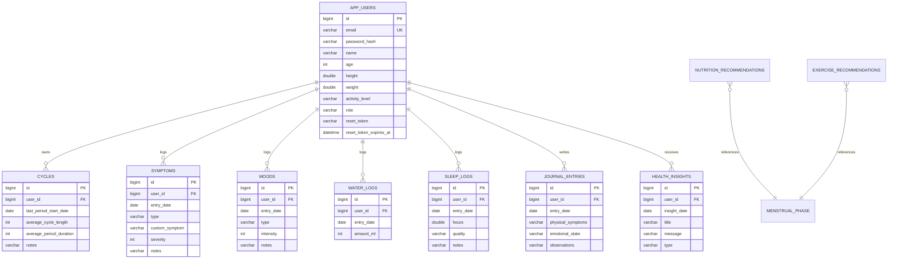

# ER Diagram Description

## Mermaid ER Diagram

## Relationship Summary

- One user owns many cycles, symptoms, moods, water logs, sleep logs, journal entries, and health insights.
- Nutrition and exercise recommendations are phase-based reference data.
- All user-owned queries filter by authenticated user to prevent cross-user access.
